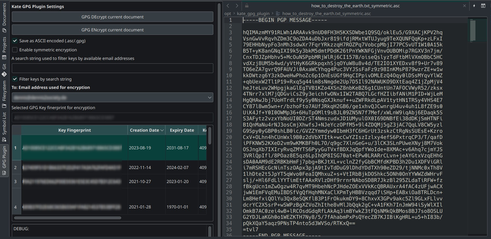

# Kate GPG Plugin

This plugin allows to GPG decrypt and encrypt text files 
using the [GPGMe library](https://gnupg.org/software/gpgme/index.html) 
in KDE's text editor KATE.



## Features
+ Plugin shows all available GPG keys with basic name filtering
  (auto-selects the most recently created key)
+ Manual selection of key used for encryption
+ Symmetric encryption possible

## Prerequisites
+ Qt development libraries are installed
+ A CMAKE & C++ build environment is installed
+ C/C++ bindings for GPGMe are installed
+ At least one public+private GPG key pair (if you want to encrypt to yourself)

## Caution!
While this plugin makes it easy to decrypt/encrypt text, it also makes it easy to
do things wrong! You could accidentally encrypt a file, e.g. with a key 
that is not yours or to accidentally save a currently decrypted file as plain 
text, leaving it unecrypted.

+ Use with care!
+ Think twice before pressing Ctrl+S!
+ Ctrl+Z works after encryption.

## Build Instructions
+ Clone the git repository
+ In the cloned repo's folder run (if it exists delete the ```./build/```-folder first just to be sure):
  1. 
    a) With local installation prefix:
    ```bash
      cmake -B build/ -D CMAKE_INSTALL_PREFIX=$HOME/kde/usr -D CMAKE_BUILD_TYPE=Release
    ```
    
    b) No prefix: (installation will use default KDE plugin path)
    ```
      cmake -B build/ -D CMAKE_BUILD_TYPE=Release
    ``` 
     
  2. ```cmake --build build/```
  3. ```(sudo) cmake --install build/```
     (sudo is only necessary for a global install (if you went with option 1.b ))
  4. (optional depending on 1.a) ```source build/prefix.sh```
  5. Run kate form the current terminal prompt
  6. Enable the GPG plugin in Kate -> Settings -> Preferences -> Configure Kate -> Plugins
     A new vertical button should appear in the left sidebar.
      
The first line creates a ```./build/``` directory and adds a parameter
to create a prefix.sh which can add a temporary Kate plugin path to your shell.
It enables a release build, too.

The second line builds the project in the previously set directory.

The third line "installs" the build plugin to depending on your choice in point 1. Temporary local
plugin path is ```~/kde/usr/lib/plugins/ktexteditor/```.
For testing purposes I have sym-linked the library to an approriate folder. Worked fine for me.
Default plugin path (on Manjaro with KDE Plasma) is ```/usr/lib/qt/plugins/ktexteditor```.

The fourth line "sources" the previously generated prefix.sh to set your 
temporary Kate plugin path so that it finds the newly built one.

Run kate from the terminal in which you have sourced the prefix.sh and enable the plugin in the Kate settings.

## TODO

+ Save/load current UI selections to/from disk
+ Fix that !#$%?X§ jumping UI bug
+ Automatically retrieve key fingerprint/ID and mail address 
  from encrypted file to set as selected "To:" key and mail address
+ Attach to KATE's "Open File" dialog to suggest automatic 
  decryption when a .gpg/.pgp/.asc file is opened
* Attach to KATE's Save/Save As dialog to strongly suggest to re-encrypt 
  a currently opened GPG file (to avoid saving it as unencrypted).
* Sign and verify documents
* Add support for subkeys

## Limitations

+ At the moment there exists an annoying UI bug where the plugin settings box jumps down when 
  changing the settings/document width. Setting the Kate window to fullscreen fixes this until 
  next resize.
+ No support for subkeys yet
+ Currently only the default email address for a key fingerprint will be used for encryption
+ Password prompts are handled by GPG(Me) and may look ugly. Won't touch this!


&copy; 2023, Dennis Lübke, kate-gpg-plugin (at) dennis2society.de
